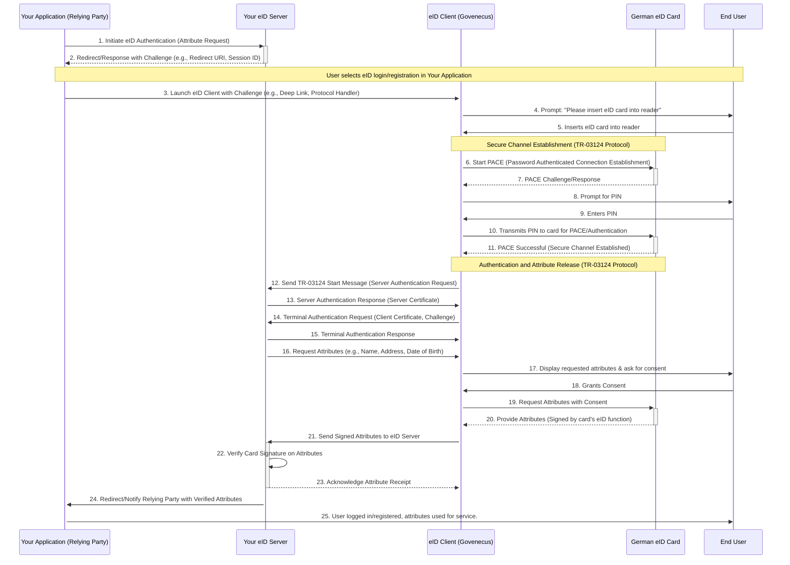

# German eID Service Architectural Outline

This document outlines the architectural considerations, essential technical components, step-by-step development process, end-to-end functional flow, protocol discussions, and compliance aspects for a German eID service leveraging the Online-Ausweisfunktion, integrated with 'Govenecus' as a specific open-source eID client implementation.

## 1. Architectural Considerations for a German eID Service

### Security and Trust
*   **Cryptographic Operations:** All sensitive communications and data exchanges must use strong cryptographic algorithms (e.g., TLS 1.2/1.3 for transport, robust asymmetric and symmetric encryption for data).
*   **Key Management:** Secure generation, storage, and management of private keys for the eID server and any relying party components are paramount. Hardware Security Modules (HSMs) should be considered for key protection.
*   **Certificate Validation:** Rigorous validation of all involved certificates (eID card, eID client, eID server, identity provider) against trusted Certificate Authorities (CAs) is crucial to prevent impersonation and man-in-the-middle attacks.
*   **Secure Coding Practices:** Adherence to secure coding guidelines to prevent common vulnerabilities (e.g., injection attacks, XSS, CSRF).
*   **Audit Logging:** Comprehensive logging of all eID transactions, including authentication attempts, attribute releases, and security events, for auditing and forensic analysis.
*   **Tamper Detection:** Mechanisms to detect and prevent tampering with the eID card, client, or server components.

### Scalability and Performance
*   **Stateless Services:** Where possible, design services to be stateless to allow for easy horizontal scaling.
*   **Asynchronous Processing:** Use asynchronous patterns for operations that might involve external dependencies or take time (e.g., communicating with backend attribute providers).
*   **Load Balancing:** Employ load balancers to distribute requests across multiple instances of the eID server components.
*   **Caching:** Implement caching strategies for frequently accessed, non-sensitive data to reduce load and improve response times.
*   **Database Scalability:** Choose a database solution that can scale with user demand and handle high transaction volumes.

### Compliance and Legal Framework (eIDAS, German eID Act)
*   **Data Minimization:** Only request and process attributes strictly necessary for the service.
*   **Consent Management:** Clear and explicit user consent mechanisms for attribute release, in line with GDPR.
*   **Data Protection:** Implementation of robust data protection measures, including encryption at rest and in transit, access controls, and pseudonymization where appropriate.
*   **TR-03124 Compliance:** Strict adherence to the BSI Technical Guideline TR-03124 requirements for eID services, covering protocols, security, and interoperability.
*   **eIDAS Interoperability:** Ensure the service is compatible with the eIDAS framework for cross-border recognition, particularly if future expansion beyond Germany is envisioned.
*   **Privacy-by-Design and Default:** Integrate privacy considerations into every stage of the system design and development.

### User Experience (UX) and Accessibility
*   **Clear Guidance:** Provide clear and concise instructions to users on how to use their eID card with the service, especially during the authentication process.
*   **Error Handling:** User-friendly error messages that guide users to resolve issues or understand why a transaction failed.
*   **Accessibility:** Design the user interface (if applicable) to be accessible to users with disabilities, adhering to WCAG standards.
*   **Performance:** Fast and responsive interactions to avoid user frustration.

### Maintainability and Extensibility
*   **Modular Architecture:** Design the system with loosely coupled, modular components to facilitate independent development, testing, and deployment.
*   **API-First Approach:** Expose functionalities through well-defined APIs to enable easy integration with other systems and future services.
*   **Technology Stack Choice:** Select mature, well-supported technologies and frameworks.
*   **Documentation:** Comprehensive documentation for architecture, APIs, and operational procedures.

### Operational Aspects
*   **Monitoring and Alerting:** Implement robust monitoring for system health, performance, and security events, with appropriate alerting mechanisms.
*   **Backup and Recovery:** Regular data backups and a tested disaster recovery plan.
*   **Deployment Automation:** Use CI/CD pipelines for automated testing, building, and deployment.

## 2. Essential Technical Components

### German eID Card (ePA - elektronischer Personalausweis)
*   **Smart Card:** The physical German identity card with the Online-Ausweisfunktion enabled.
*   **Embedded Chip:** Contains cryptographic keys and personal attributes (e.g., name, date of birth, address) secured by a PIN.

### eID Client (Govenecus)
*   **Card Reader Interface:** Software component to interact with the PC/SC API for communication with smart card readers.
*   **eID Card Communication Module:** Handles the low-level communication with the eID card's chip via APDUs (Application Protocol Data Units).
*   **PIN Management:** Securely prompts the user for their PIN and transmits it to the eID card.
*   **Consent Management:** Presents the user with the requested attributes and obtains explicit consent for their release.
*   **TR-03124 Client Implementation:** Implements the client-side of the BSI TR-03124 protocol for secure communication with the eID server. This includes:
    *   **PACE (Password Authenticated Connection Establishment):** For secure channel establishment with the eID card.
    *   **Chip Authentication:** Authenticates the card's chip to the client.
    *   **Terminal Authentication:** Authenticates the client (terminal) to the eID card.
    *   **Access Condition Handling:** Manages the conditions under which attributes can be read from the card.
*   **User Interface (UI):** For user interaction, displaying information, and collecting input (e.g., PIN).
*   **Network Communication Module:** Establishes secure TLS connections to the eID server for protocol communication.

### eID Server (Your Existing eID Server)
*   **TR-03124 Server Implementation:** Implements the server-side of the BSI TR-03124 protocol for secure communication with the eID client. This includes:
    *   **Session Management:** Manages the eID transaction session state.
    *   **Server Authentication:** Authenticates itself to the eID client using its server certificate.
    *   **Request Generation:** Generates attribute requests to be presented to the user via the client.
    *   **Signature Verification:** Verifies the cryptographic signatures generated by the eID card (via the client) to confirm the user's identity and attribute release consent.
*   **Cryptographic Module:** Handles cryptographic operations such as:
    *   **TLS Termination:** Securely terminates TLS connections from the eID client.
    *   **Certificate Storage & Management:** Securely stores and manages the server's own TLS and eID certificates, and trusts the necessary CA certificates for client and card validation.
    *   **Signature Generation & Verification:** For server-side signing and verification of eID protocol messages.
*   **Attribute Processing Module:**
    *   **Attribute Request Handling:** Parses incoming attribute requests.
    *   **Attribute Extraction:** Extracts requested attributes from the eID protocol response.
    *   **Attribute Mapping:** Maps raw eID attributes to internal data models if necessary.
*   **User/Session Management:** Associates eID sessions with application-specific user sessions.
*   **API/Endpoint for Relying Parties (RPs):** Provides a secure interface for your application (Relying Party) to initiate eID authentication requests and receive verified attributes. This could be a SAML, OpenID Connect, or a custom REST API.
*   **Database/Persistence Layer:** Stores session data, audit logs, and potentially user profiles linked to eID attributes (if applicable and compliant with data minimization).
*   **Audit Log Module:** Records all significant events and data exchanges for compliance and debugging.

### Smart Card Reader
*   **Physical Device:** A hardware device (internal or external) capable of reading smart cards conforming to ISO/IEC 7816.
*   **PC/SC Compatibility:** Must be compatible with the PC/SC (Personal Computer/Smart Card) standard for interaction with the eID client.

### Relying Party Application (Your Application)
*   **eID Integration Client:** A component within your application that interacts with your eID Server's API to initiate eID authentication and receive attributes.
*   **User Interface:** Directs users to initiate the eID process and displays results.
*   **User Account Management:** Links eID-verified identities to your application's user accounts.
*   **Attribute Consumption:** Uses the verified attributes for authorization, personalization, or other business logic.

### Trust Anchor / Certificate Authority Infrastructure
*   **Root Certificates:** Trust anchors for verifying the authenticity of eID cards, eID clients (if applicable), and eID servers. These are typically provided by national authorities (e.g., BSI in Germany).

### Component Interaction Diagram
```mermaid
graph TD
    A[German eID Card] -->|ISO/IEC 7816 APDUs| B(Smart Card Reader)
    B -->|PC/SC API| C(eID Client: Govenecus)
    C -->|TR-03124 Client Side over TLS| D(Your Existing eID Server)
    D -->|Relying Party API (e.g., SAML, OIDC, REST)| E(Your Application: Relying Party)

    subgraph User Interaction
        C -- UI --> U[End User]
        U -- PIN Input --> C
    end

    subgraph Trust Infrastructure
        CA[Certificate Authorities] --> C
        CA --> D
        CA --> A
    end

    style A fill:#f9f,stroke:#333,stroke-width:2px
    style C fill:#ccf,stroke:#333,stroke-width:2px
    style D fill:#cfc,stroke:#333,stroke-width:2px
    style E fill:#ffc,stroke:#333,stroke-width:2px
```

## 3. Step-by-Step Development Process

### Phase 1: Planning & Setup

1.  **Detailed Requirements Analysis:**
    *   Identify Relying Party (RP) needs: What attributes are required from the eID card for your specific application?
    *   User Journeys: Map out all possible user flows for eID authentication and attribute release.
    *   Regulatory Deep Dive: Thoroughly understand the German eID Act (eID-Gesetz), TR-03124, and relevant aspects of eIDAS and GDPR.
    *   Risk Assessment: Identify potential security, privacy, and operational risks.

2.  **Technology Stack Selection & Environment Setup:**
    *   Confirm the programming language and frameworks for your eID server.
    *   Set up development, testing, and production environments.
    *   Choose a suitable database for session management, logging, etc.

3.  **Certificate Acquisition & Management Strategy:**
    *   Obtain necessary certificates for your eID server (TLS, eID server certificates from a trusted CA).
    *   Define a secure key management strategy (e.g., using HSMs, secure storage).
    *   Integrate trust anchors for German eID infrastructure into your server.

### Phase 2: Core eID Server Development

1.  **TR-03124 Protocol Implementation (Server-Side):**
    *   Secure Connection Establishment: Implement TLS termination and server authentication.
    *   Session Management: Develop robust session handling for eID transactions.
    *   PACE & Chip Authentication: Implement the server-side logic for PACE and verifying chip authentication.
    *   Terminal Authentication: Implement the server-side logic for verifying terminal authentication (of the eID client).
    *   Attribute Request Generation: Develop mechanisms to construct valid attribute requests (e.g., [`DIDAuthenticate`](https://www.bsi.bund.de/SharedDocs/Downloads/EN/BSI/Publications/TechGuidelines/TR03124/TR03124-1_eID-Server_Part1_V2_3_EN.pdf:143), [`DIDAuthenticateEAC1`](https://www.bsi.bund.de/SharedDocs/Downloads/EN/BSI/Publications/TechGuidelines/TR03124/TR03124-1_eID-Server_Part1_V2_3_EN.pdf:144)).
    *   Signature Verification: Implement robust verification of cryptographic signatures from the eID card to ensure authenticity and integrity of attributes.
    *   Error Handling: Implement detailed error handling as per TR-03124 specifications.

2.  **Attribute Processing & Mapping:**
    *   Develop modules to parse the received eID attributes from the client.
    *   Map these attributes to your application's internal user data model.
    *   Implement data minimization: ensure only necessary attributes are processed and stored.

3.  **Relying Party (RP) API Development:**
    *   Design and implement a secure API for your application to interact with the eID server (e.g., RESTful, SAML, OpenID Connect).
    *   Define endpoints for initiating eID authentication and retrieving verified user attributes.
    *   Implement authentication and authorization for the RP API.

4.  **Security Measures Integration:**
    *   Implement secure coding practices, input validation, and output encoding.
    *   Integrate security headers (e.g., HSTS, CSP).
    *   Set up robust logging for security events and audit trails.

### Phase 3: eID Client (Govenecus) Integration & Testing

1.  **Govenecus Integration:**
    *   Understand the Govenecus API and integration points.
    *   Adapt or extend Govenecus if custom functionalities are required (e.g., specific UI elements).
    *   Ensure secure communication channel establishment between Govenecus and your eID server.

2.  **End-to-End Functional Testing:**
    *   Unit Tests: For individual components of the eID server and its interfaces.
    *   Integration Tests: Verify communication between eID server and Govenecus, and between eID server and your RP application.
    *   System Tests: Simulate real-world scenarios with physical eID cards and card readers.
    *   Usability Testing: Ensure the user experience, especially with Govenecus and card interaction, is intuitive.

3.  **Security Testing:**
    *   Penetration Testing: Engage security experts to perform penetration tests on the eID server and the entire integration.
    *   Vulnerability Scans: Regularly scan for known vulnerabilities.
    *   Compliance Audits: Verify adherence to TR-03124, eIDAS, and GDPR requirements.

### Phase 4: Deployment & Operations

1.  **Deployment Automation:**
    *   Implement CI/CD pipelines for automated testing, building, and deployment of your eID server.
    *   Automate certificate deployment and renewal processes.

2.  **Monitoring & Alerting:**
    *   Set up comprehensive monitoring for system health, performance, security events, and audit logs.
    *   Configure alerts for critical issues.

3.  **Documentation:**
    *   Develop detailed operational documentation for deployment, troubleshooting, and maintenance.
    *   Create developer documentation for the RP API.

4.  **Incident Response Plan:**
    *   Establish a clear incident response plan for security breaches or operational failures.

### Phase 5: Certification & Compliance

1.  **Official Certification (if required):**
    *   Depending on the specific use case and trust level, your eID service might require formal certification from the BSI (Bundesamt für Sicherheit in der Informationstechnik) or other relevant authorities. This will involve rigorous audits and assessments.
    *   Prepare all necessary documentation for the certification process.

2.  **Ongoing Compliance:**
    *   Regularly review and update the service to comply with evolving regulations (eIDAS, GDPR, German eID Act) and technical guidelines (TR-03124).

## 4. End-to-End Functional Flow



## 5. Role of TR-03124 and Other Relevant Protocols

The security and interoperability of the German eID service rely heavily on a stack of interconnected protocols and standards.

### BSI Technical Guideline TR-03124 (eID-Server)
*   **Most critical and central protocol** for your eID server, defining the technical requirements for the interface between the eID client and the Relying Party.
*   **Key Aspects:** Standardized Interface, Secure Channel Establishment (TLS), Mutual Authentication (Server & Terminal Authentication), Attribute Request and Release (e.g., [`DIDAuthenticate`](https://www.bsi.bund.de/SharedDocs/Downloads/EN/BSI/Publications/TechGuidelines/TR03124/TR03124-1_eID-Server_Part1_V2_3_EN.pdf:143), [`DIDAuthenticateEAC1`](https://www.bsi.bund.de/SharedDocs/Downloads/EN/BSI/Publications/TechGuidelines/TR03124/TR03124-1_eID-Server_Part1_V2_3_EN.pdf:144) messages), Signature Verification, Session Management, Error Handling, and overall Compliance.

### PACE (Password Authenticated Connection Establishment)
*   **Role:** Establishes a secure, authenticated, and encrypted channel between the eID client and the eID card, protecting communication.
*   **Interaction with TR-03124:** Prerequisite for the eID client to establish its secure connection with the eID server as per TR-03124.

### Chip Authentication & Terminal Authentication (EAC - Extended Access Control)
*   **Role:** Mutual authentication between the eID client and the eID card. Chip Authentication verifies the card's chip; Terminal Authentication verifies the client's authorization to access card data.
*   **Interaction with TR-03124:** Terminal Authentication is directly referenced and utilized within the TR-03124 context.

### PKI (Public Key Infrastructure)
*   **Role:** Foundational for all cryptographic operations (certificates, Certificate Authorities, revocation mechanisms).
*   **Interaction with TR-03124:** Heavily relied upon for mutual authentication and signature verification.

### ISO/IEC 7816 (Smart Card Standard) and PC/SC (PC/Smart Card)
*   **Role:** Lower-level standards for physical smart card communication. ISO/IEC 7816 defines card characteristics and protocols; PC/SC provides a standard interface for readers.
*   **Interaction with TR-03124:** Fundamental enablers, operating beneath the logical level of TR-03124.

### Transport Layer Security (TLS)
*   **Role:** Provides secure communication over a network, ensuring confidentiality, integrity, and authentication.
*   **Interaction with TR-03124:** Mandated for the secure communication channel between the eID client and the eID server.

### Relying Party Protocols (e.g., SAML 2.0, OpenID Connect, Custom REST)
*   **Role:** Define how your eID Server communicates with your Application to convey authentication results and release verified attributes.
*   **Interaction with TR-03124:** Operate "above" TR-03124, delivering the verified attributes to your application once the eID server has processed them.

## 6. Handling Authentication and Attribute Release

### Authentication
Authentication is a multi-layered process ensuring the authenticity of all participants:

*   **User-to-Card Authentication (PIN Verification):** User enters PIN into Govenecus, which is verified by the eID card internally. This establishes user's possession and knowledge.
*   **Card-to-Client Authentication (Chip Authentication):** Govenecus cryptographically verifies the eID card's authenticity.
*   **Client-to-Card Authentication (Terminal Authentication):** The eID card verifies Govenecus's authorization via its certificate.
*   **Server-to-Client Authentication:** Govenecus verifies your eID Server's authenticity via its TLS certificate.
*   **Client-to-Server Authentication (Terminal Authentication in TR-03124 Context):** Your eID Server verifies Govenecus's authenticity via its client certificate.
*   **Server Verification of Card's Signature (Ultimate Authentication):** Your eID Server verifies the cryptographic signature on the attributes received from the eID card. This confirms identity, user consent, and data integrity.

### Attribute Release
Attribute release is tightly controlled, emphasizing privacy and data minimization:

*   **Relying Party (RP) Specifies Requirements:** Your Application requests only necessary attributes from your eID Server, adhering to data minimization.
*   **eID Server Generates Attribute Request:** The eID Server constructs a TR-03124 compliant attribute request.
*   **User Consent via eID Client (Govenecus):** Govenecus displays requested attributes to the user, requiring explicit consent for each.
*   **eID Card Provides Signed Attributes:** With consent, the eID card securely provides cryptographically signed attributes over the PACE channel.
*   **Secure Transmission to eID Server:** Govenecus transmits the signed attributes to your eID Server over TLS.
*   **eID Server Attribute Validation and Processing:** Your eID Server verifies the signature, card certificate, extracts verified attributes, and ensures only consented, requested data is processed.
*   **Attribute Delivery to Relying Party:** The eID Server securely transmits the verified attributes to your Application (e.g., via SAML, OIDC, or custom API).

## 7. Ensuring Compliance with German eID and eIDAS Regulations

Compliance is built-in through adherence to standards, robust implementations, and clear procedures:

### Compliance with the German eID Act (eID-Gesetz)
*   **Online-Ausweisfunktion:** Relies on and securely uses this function.
*   **Voluntary Use:** Ensures the eID function is always optional.
*   **User Consent:** Mandatory explicit consent for attribute release.
*   **Data Minimization:** Only necessary attributes are requested and processed.
*   **Prohibition of Storage of Access Numbers:** Never stores CAN or MRZ.
*   **No Central Storage of PINs:** PINs are card-local.
*   **Reliable Identification:** Achieves high assurance for identity verification.

### Compliance with BSI Technical Guideline TR-03124
*   **Full Protocol Implementation:** Adherence to all client-server interaction steps.
*   **Cryptographic Security:** Uses specified algorithms, key lengths, and secure parameters.
*   **Certificate Handling:** Strict validation of all certificates against trusted German CAs.
*   **Error Handling:** Implements defined error codes and recovery.
*   **Logging and Audit:** Comprehensive, tamper-proof logging for all eID transactions.

### Compliance with eIDAS Regulation (EU Regulation 910/2014)
*   **Interoperability:** Alignment with TR-03124 supports eIDAS principles.
*   **Levels of Assurance:** Leverages the German eID card's "high" LoA.
*   **Attribute Sets:** Processes attributes as defined by eIDAS.
*   **Cross-Border Use:** Foundational compliance for future eIDAS integration.

### Compliance with GDPR (General Data Protection Regulation)
*   **Lawfulness, Fairness, Transparency:** Processing based on consent and necessity, informed users.
*   **Purpose Limitation:** Data used only for stated purposes.
*   **Data Minimization:** Only strictly necessary data processed.
*   **Accuracy:** Relies on official eID card data.
*   **Storage Limitation:** Data retained only as long as necessary.
*   **Integrity and Confidentiality:** Robust technical and organizational security measures.
*   **User Rights:** Application privacy policy outlines user rights.
*   **DPIA:** May require a Data Protection Impact Assessment.
*   **Records of Processing Activities:** Maintains detailed records.

### Organizational Measures and Documentation
*   **Security Policies:** Clear policies for development, operation, incident response.
*   **Staff Training:** Regular training on security, privacy, compliance.
*   **Regular Audits:** Internal and external verification of ongoing compliance.
*   **Documentation:** Comprehensive system, security, data processing, and compliance documentation.
*   **Incident Response Plan:** Defined plan for security incidents and data breaches.